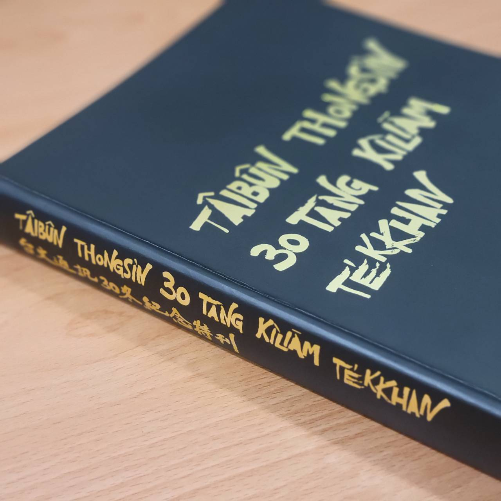

## 網站紹介
Chit ê網站是為tio̍h **Siau Lah-jih（蕭平治）**先生ê著作**《Tâi-oân Sio̍k-gí Kiâm-sng-tiⁿ (台灣俗語鹹酸甜)》**來設--ê。

Siau Lah-jih（蕭平治）先生chit本著作ê內容實在是不止á豐沛，mā是台灣人寶貴ê語言kap文化資產。伊一直真khòa心，向望chia ê智識有機會thang ka thn̂g--lo̍h-去。所致，伊決定將chit本iáu-bē出版ê冊，完整公開tī網路頂koân。

> 特別感謝Lah-jih兄，做台語文長期ê實踐者，koh無私奉獻伊ê智識。

邀請大家做伙來讀台文，學習咱台灣作田人寶貴ê歷史kap記tî！

## 版權告白
* 本網站內底ê內容著作權屬原作者 Siau Lah-jih（蕭平治）先生。
* 所有ê資料單單tī網站頂面thang看，是beh利便社會大眾學習台語文，**歡迎自由分享chit ê網站ê網址**。
* **禁止做其他任何形式ê路用，包括直接lia̍h網站畫面、直接kho͘圖片、文字內容去其他所在轉貼等等。**
* 著作權 © Siau Lah-jih（蕭平治）

## 計劃團隊
* 作者、指導：Siau Lah-jih（蕭平治）
* 共同發起人：Siau Lah-jih（蕭平治）、Chhòa It-bîn、Koa-ông Péng-hun、N̂g Ú-iûⁿ、Ngô͘ Hê-bí
* 總編輯：Chhòa It-bîn、Ngô͘ Hê-bí
* 內容編輯：Chhòa It-bîn、Koa-ông Péng-hun、N̂g Ú-iûⁿ、Ngô͘ Hê-bí
* 網站：Ngô͘ Hê-bí（Tâi-bûn Ke-si-mī／台文雞絲麵）

## 建議、聯絡
Nā網站內容有任何問題a̍h是建議，請聯絡網站負責人 Ngô͘ Hê-bí（[Tâi-bûn Ke-si-mī／台文雞絲麵](https://www.zeczec.com/projects/taibun-kesimi)）。

    電子phoe：taibunkesimi+chohchhanlang@gmail.com